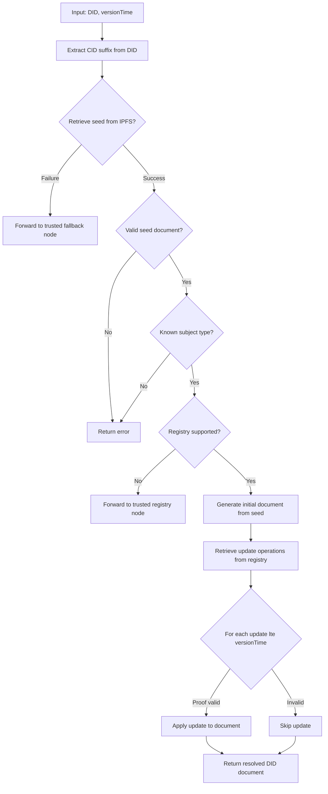

## DID Resolution

[[def: resolution, The process of returning the DID document and its metadata for a given DID — distinct from dereferencing, which returns a resource identified by a DID URL]]

Resolution is the operation of returning a DID Document and its metadata for a given DID. It is distinct from *dereferencing*, which returns a resource identified by a DID URL (see DID URL Dereferencing).

Given a DID and an optional resolution time, the resolver retrieves the associated [[ref: seed document]] from IPFS using the DID suffix as the CID, parsing it as plaintext JSON.

### Resolution Options

The `did:cid` method supports the following resolution options per [[ref: DID-CORE]]:

| Option | Type | Description |
|--------|------|-------------|
| `versionTime` | ISO 8601 datetime | Resolve the DID document as it existed at or before this point in time |
| `versionSequence` | integer | Resolve at a specific operation sequence number (1-indexed from creation) |
| `versionId` | CID string | Resolve at the operation identified by this specific CID |

If no option is specified, the resolver returns the most recent confirmed version.

::: note
`versionId` accepts the CID of any operation in the DID's [[ref: operation chain]], enabling pinpoint resolution at any historical state. This is the most precise resolution mode — `versionTime` and `versionSequence` both reduce to a `versionId` lookup internally once the target operation is identified.
:::

---

### Resolution Algorithm



### Pseudocode

```
function resolveDid(did, versionTime=now):
    get suffix from did
    use suffix as CID to retrieve seed document from IPFS
    if fail to retrieve the seed document:
        forward request to a trusted node
        return
    look up did's registry in its seed document
    if did's registry is not supported by this node:
        forward request to a trusted node
        return
    generate initial document from seed
    retrieve all update operations from did's registry
    for all updates until versionTime:
        if proof is valid and update is valid:
            apply update to DID document
    return DID document
```

### Resolution Result

A conformant resolution returns only the three members defined by the [[ref: DID-CORE]] DID Resolution data model:

- `didDocument`
- `didResolutionMetadata`
- `didDocumentMetadata`

The method-specific `didDocumentData` and `didDocumentRegistration` objects are **not** part of the resolution result; they are exposed as dereferenceable resources (see DID URL Dereferencing). Standard document metadata — `created`, `updated`, `deleted`, `deactivated`, `versionId`, `versionSequence`, `canonicalId` — is carried in `didDocumentMetadata`.

The method-specific `confirmed` and `timestamp` fields are **not** [[ref: DID-CORE]] document metadata, so they are not carried in `didDocumentMetadata`; they are anchoring provenance, returned with the registration resource at `/registration`.

`didResolutionMetadata` carries `contentType` — the media type of the returned representation.

```json
{
  "didDocument": { "id": "did:cid:<cid>", "...": "..." },
  "didResolutionMetadata": {
    "contentType": "application/did+ld+json"
  },
  "didDocumentMetadata": {
    "created": "2026-01-14T19:32:24Z",
    "versionId": "bagaaiera...",
    "versionSequence": "1"
  }
}
```

### Representations

The resolver negotiates the DID document representation from the `Accept` request header, and echoes the selected media type in both the `Content-Type` response header and `didResolutionMetadata.contentType`:

| `Accept` | Representation |
|----------|----------------|
| `application/did+ld+json` (or absent) | JSON-LD — the default |
| `application/did+json` | Plain JSON |

Responses set `Vary: Accept`. This applies to the resolution result only; the `/data` and `/registration` resources are plain `application/json`.

### Endpoints

The resolution and dereferencing surface follows the [Universal Resolver](https://github.com/decentralized-identity/universal-resolver) driver convention:

| DID URL | HTTP | Returns |
|---------|------|---------|
| `did:cid:<cid>` | `GET /1.0/identifiers/<did>` | DID Resolution result (the triple) |
| `did:cid:<cid>/data` | `GET /1.0/identifiers/<did>/data` | The data resource |
| `did:cid:<cid>/registration` | `GET /1.0/identifiers/<did>/registration` | The registration resource |

This surface always returns confirmed, cryptographically verified state.

### Fallback and Forwarding

If a node cannot fulfill a resolution request — either because the seed document is unreachable on IPFS or because the DID's specified registry is not supported — the node must forward the request to a trusted node. The forwarding chain is:

1. **Registry not supported** → forward to a trusted node that monitors the specified registry.
1. **No trusted node for registry** → forward to a general-purpose fallback node.
1. **IPFS seed unreachable** → forward to a node with broader IPFS connectivity.

### Ordinal Key Ordering

Update records from the registry are ordered by an [[def: ordinal key, A tuple of values used to sort update operations into chronological order, specific to the registry type — e.g., `{block index, transaction index, batch index}` for BTC]]. This ensures deterministic resolution regardless of node synchronization timing.